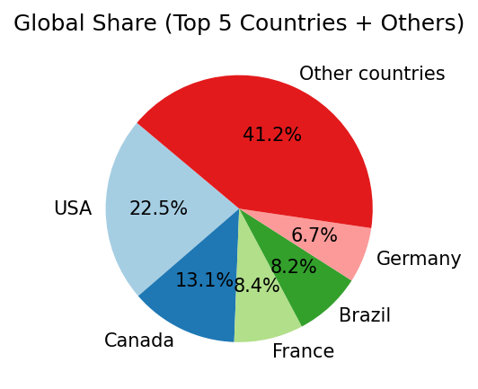
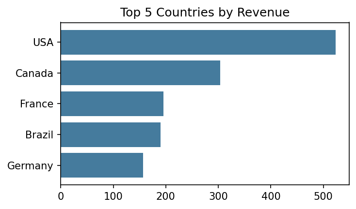
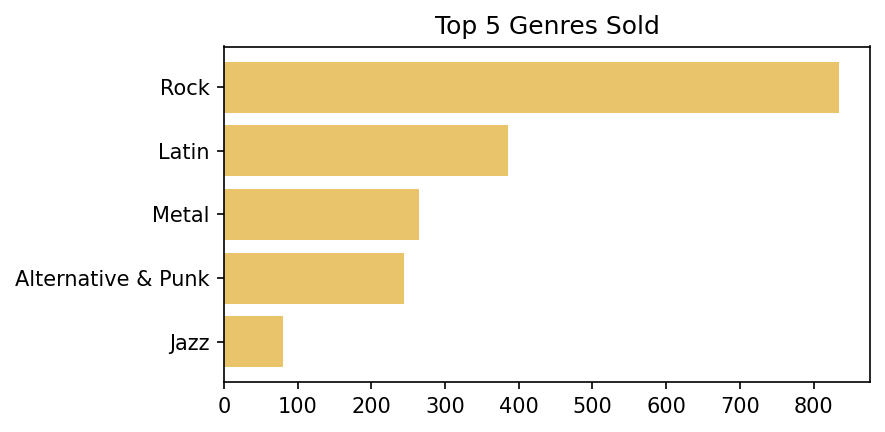
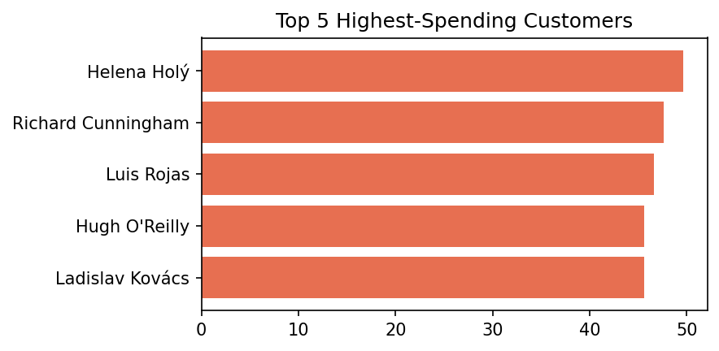
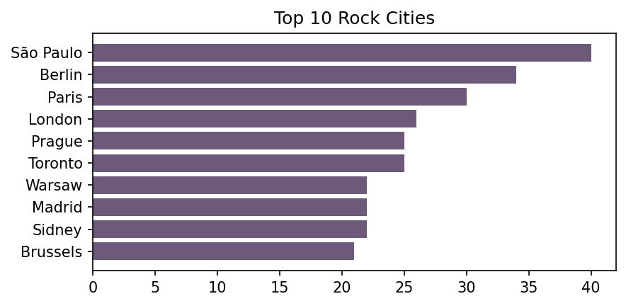

# Music Store Sales Analysis (SQL)

## Project Overview
This project performs an end-to-end business analysis on the **Chinook Music Store** database using **PostgreSQL**. The goal is to assist management in optimizing business operations, tracking employee performance, understanding customer spending behavior, and planning targeted marketing campaigns.

---

## Database Structure
The analysis queries data across a relational schema consisting of multiple connected tables, including:
* `employee` (Staff tracking)
* `customer` (Client demographics)
* `invoice` & `invoice_line` (Sales transactions)
* `track` & `genre` (Music inventory)

---

## Business Questions & Key Insights

### 1. Top Performing Employee
* **Question:** Who is our top-performing sales support representative based on total sales?

* **Insight:** **Jane Peacock** emerged as the top sales support representative. Recognizing top internal performers allows management to identify leadership potential and replicate successful customer-service strategies across the team.

| Top Sales Support Representatives |
| :---: |
|  |

### 2. Global Revenue by Country
* **Question:** Which countries are generating the most money for the store?
* **Insight:** The **USA and Canada** stand out as the highest-grossing markets. This crucial geographic insight tells the marketing department exactly where to allocate the bulk of their international advertising budgets for maximum ROI.

| Global Share (Pie Chart) | Top 5 breakdown (Bar Chart) |
| :---: | :---: |
|  |  |

### 3. Content Optimization (Rock vs. Other Genres)
* **Question:** Which music genres sell the best? Should we modify our inventory?
* **Insight:** **Rock** is our undisputed king of content with **835 tracks sold**, followed by Latin (386) and Metal (264). Conversely, **Opera** generated 0 sales. 
* **Actionable Recommendation:** Management should stop purchasing underperforming genres like Opera to save on database upkeep and licensing costs, and double down on Rock and Latin inventory.

| Top 5 genres sold |
| :---: |
|  |

### 4. VIP Loyalty Program
* **Question:** Who are our top 5 highest-spending customers?
* **Insight:** **Helena Holý** is our absolute biggest VIP customer, with a total historical spend of **$49.62**. 
* **Technical Note:** Queries were strictly grouped by `customer_id` rather than names to prevent data overlapping from different customers sharing identical names.

| Top 5 Highest-Spending Customers |
| :---: |
|  |

### 5. Regional Market Expansion (Top 10 Rock Music Cities)
* **Question:** Which 10 international cities consume the highest volume of Rock music? 
* **Insight:** **São Paulo, Berlin, and Paris** hold the top three slots, but expanding the view to a Top 10 reveals a massive, highly active consumer base across Europe and South America. 
* **Actionable Business Strategy:** Instead of launching a singular event, the marketing and touring departments should utilize this Top 10 data to map out a **Global Promotional Tour**. Resources should be allocated toward localized ad campaigns and partnerships with local venues specifically within these ten high-affinity urban hubs to guarantee high ticket sales and merchandise turnover.

| Top 10 Rock-Consuming Cities |
| :---: |
|  |

| Top 10 cities  |
| :---: |
|  |

---

## Technical Skills Demonstrated
* **Multi-Table Joins:** Linking up to 4 tables concurrently (`invoice` ➡️ `invoice_line` ➡️ `track` ➡️ `genre`) using `INNER JOIN` and `LEFT JOIN`.
* **Advanced Aggregations:** Utilizing `SUM()`, `COUNT()`, and `GROUP BY` on distinct primary keys to maintain data integrity.
* **Post-Aggregation Filtering:** Using the `HAVING` clause to scrub null and empty datasets from analytical views.
* **Sorting & Subsetting:** Implementing `ORDER BY DESC` and `LIMIT` constraints to extract top-tier business metrics.

---

## How to Run the Queries
1. Ensure you have a PostgreSQL server running locally.
2. Execute the `Chinook_PostgreSql.sql` file to build the database schema and populate the sample records.
3. Open any of the numbered `.sql` query files (e.g., `5_rock_cities.sql`) in your preferred SQL client or VS Code and run the block to see the results.

---

## Data Source & Acknowledgments
This project utilizes the open-source **Chinook Database**, which simulates a digital media store's business data (including artists, albums, tracks, and customer transactions). 
* **Repository Source:** [lerocha/chinook-database on GitHub](https://github.com/lerocha/chinook-database)
* **License:** Public Domain / MIT License
